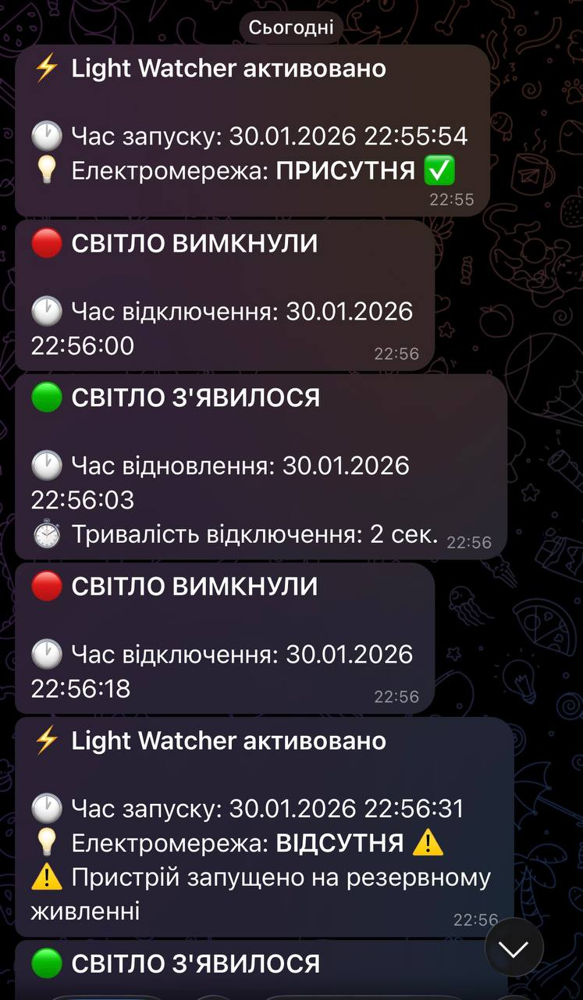

# Light Watcher
## Телеграм бот на esp32 для пінгування світла.

<!-- Тут буде посилання на ютуб відео -->

# Опис:
Телеграм бот який сповіщає про наявність зникнення та появу електромережі з точністю до хвилини, вміє синхронізуватись з реальним часом та збирає мінімальну статистику.

# Особливості:
- Рахує точну кількість часу впробовж якого світло було відсутнє
- Має захист від розряду батареї
    - Таким чином якщо світло пропало та заряду батареї не вистачило, бот всерівно сповістить про появу світла, та підрахує час скільки його не було, одразу коли воно з'явиться
  
- Безперебійне живлення для ESP32
    - Якщо електромережа пропадає, ESP32 одразу переходить на живлення від акумулятору без перезавантаження
  
- Можливість юота писати та отримувати повідомлення з загальниг груп, щоб сповістити максимальну кількість людей
- Надійне з'єднання з WiFi
    - ESP32 перевіряє наявність WiFi мережі кожних 30 секунд, якщо вона відсутня мікроконтролер пробує реконектитись, так забезпечується надійніше з'єднання з мережею
- Зручний та компактний 3Д друкований корпус для пристрою

# Приклад як це виглядає у Telegram:

  
  

## Список команд для бота:
/info - Про бота
/status - Стан системи
/set_summer_time - Встановити літній час
/set_winter_time - Встановити зимовий час
/clear_data  - Очистити статистику
/restart - Віддалений перезапуск бота

Також бот вміє реагувати на запитання: "Світло є чи нема?"

