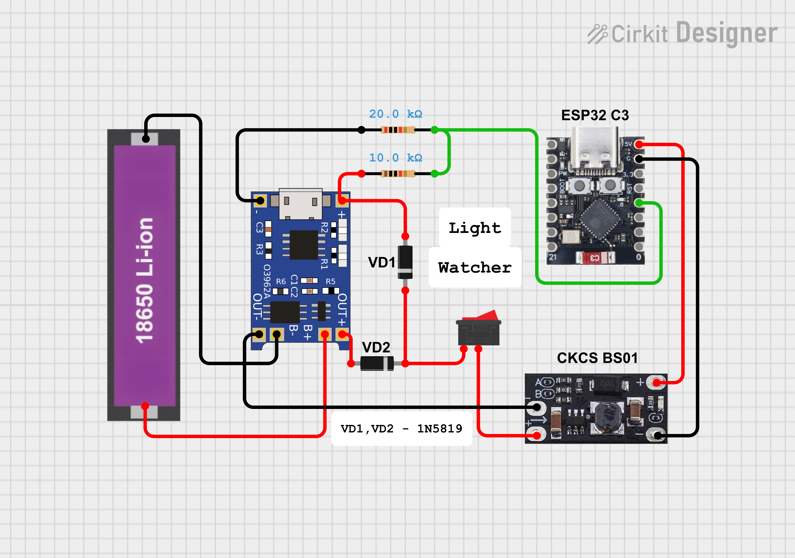
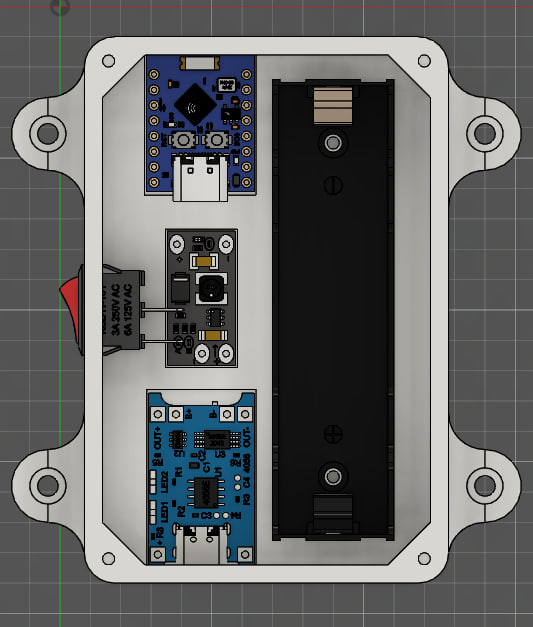
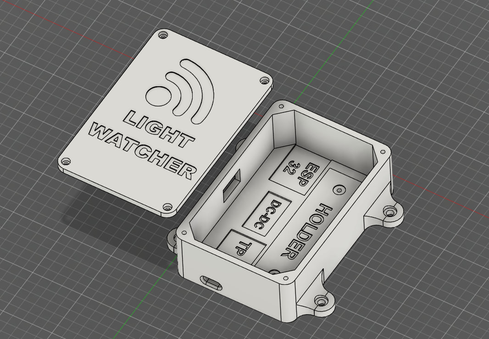
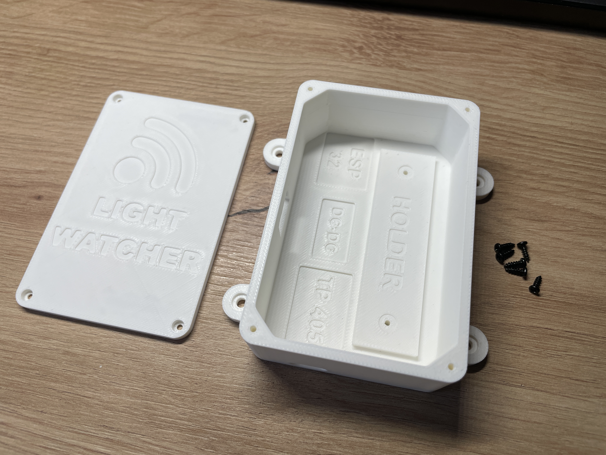
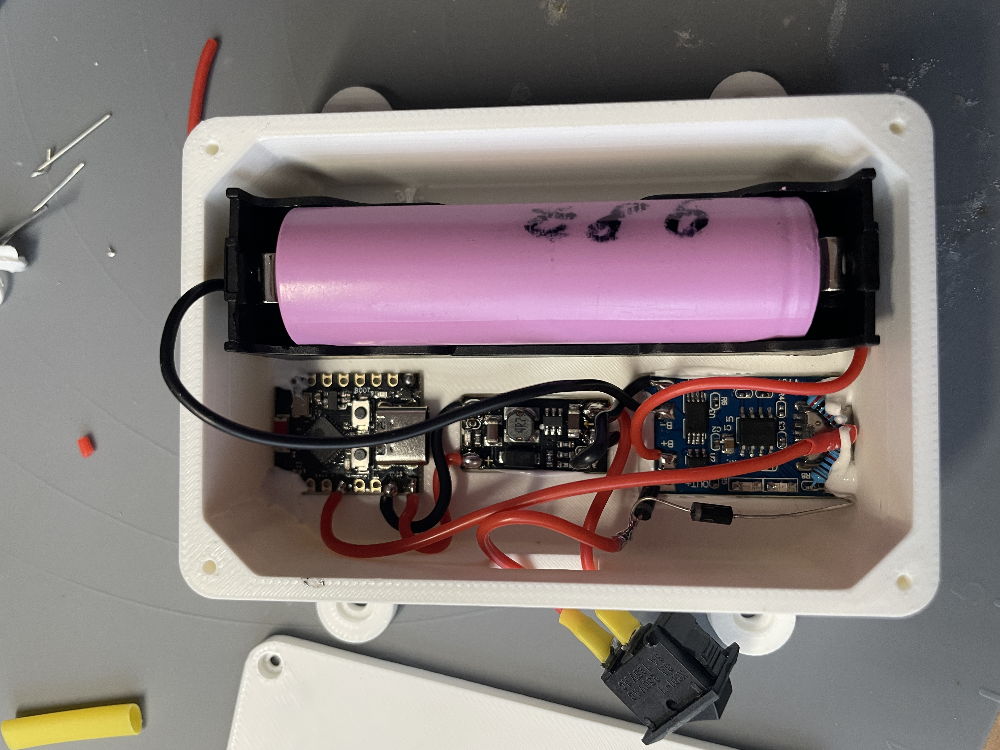
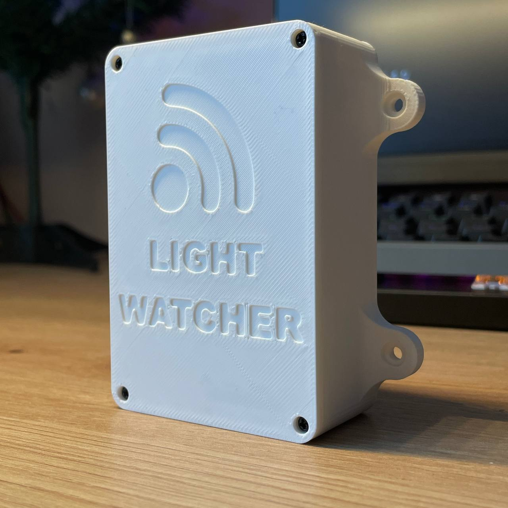
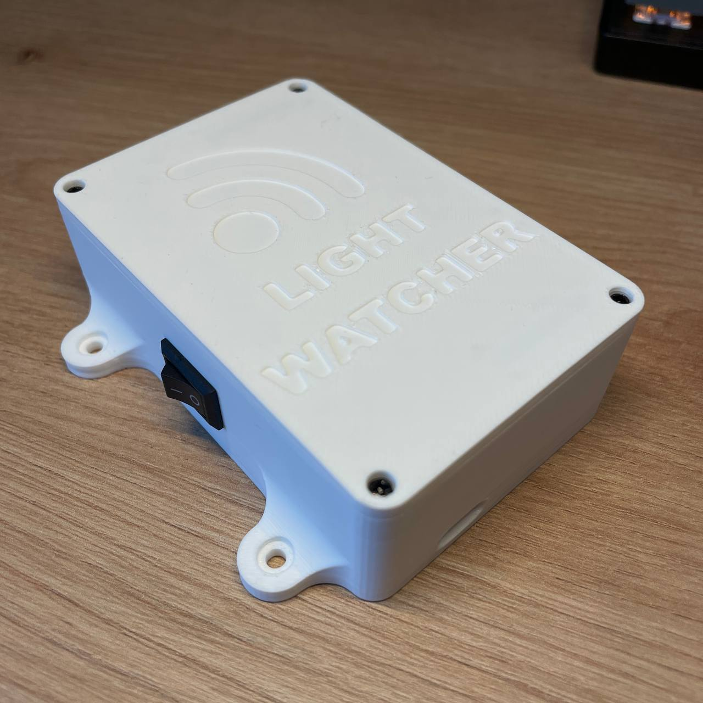

# Light Watcher
### Телеграм бот на ESP32 для моніторингу електромережі

[](https://www.arduino.cc/)[](https://www.espressif.com/)[](https://telegram.org/)

<!-- TODO: Додати посилання на YouTube відео -->

</div>

## Опис

Телеграм бот який сповіщає про зникнення та появу електромережі з точністю до хвилини, вміє синхронізуватись з реальним часом та збирає мінімальну статистику.

## Особливості

- Рахує точну кількість часу протягом якого світло було відсутнє
- Має захист від розряду батареї - якщо світло пропало та заряду батареї не вистачило, бот все одно сповістить про появу світла та підрахує час скільки його не було
- Безперебійне живлення для ESP32 - при зникненні електромережі ESP32 одразу переходить на живлення від акумулятора без перезавантаження
- Можливість писати та отримувати повідомлення в загальних групах, щоб сповістити максимальну кількість людей
- Надійне з'єднання з WiFi - ESP32 перевіряє наявність WiFi мережі кожні 30 секунд, якщо вона відсутня мікроконтролер намагається підключитись знову
- Зручний та компактний 3D друкований корпус

## Приклад роботи в Telegram

<p align="center">
  
  
</p>

## Команди бота

```
/info - Про бота
/status - Стан системи
/set_summer_time - Встановити літній час
/set_winter_time - Встановити зимовий час
/clear_data - Очистити статистику
/restart - Віддалений перезапуск бота
```

Також бот вміє реагувати на запитання: "Світло є чи нема?"

## Налаштування Telegram бота

### 1. Створення бота
Створіть бота у Телеграмі за допомогою [@BotFather](https://t.me/botfather) та збережіть отриманий токен. [Детальна інструкція](https://ukr-bot.com/yak-stvoryty-telehram-bota-cherez-botfather/)

### 2. Налаштування команд
У @BotFather виберіть: Edit Bot → Edit Commands → Вставте:
```
info - Про бота
status - Стан системи
set_summer_time - Встановити літній час
set_winter_time - Встановити зимовий час
clear_data - Очистити статистику
restart - Віддалений перезапуск бота
```

### 3. Налаштування групи (опціонально)
Якщо плануєте додати бота у групу:
- У @BotFather: Bot Settings → Allow Groups? → Увімкніть
- Додайте бота у групу та зробіть його адміністратором

### 4. Отримання Chat ID
Дізнайтеся свій Chat ID та Chat ID групи за допомогою бота [@myidbot](https://t.me/myidbot)

## Схема підключення



## Необхідні компоненти


| № | Назва | Кількість |
| :---: | :--- | :---: |
| 1 | [Мікроконтролер ESP32 C3 SuperMini](https://tinyurl.com/4h6e2k6n) | 1шт |
| 2 | [Підвищуючий dc-dc перетворювач CKCS BS01](https://tinyurl.com/34p7wcya) | 1шт |
| 3 | [Плата заряду TP4056](https://tinyurl.com/2sxvzadh) | 1шт |
| 4 | Діоди Шотткі 1N5819 | 2шт |
| 5 | Резистор 10kΩ | 1шт |
| 6 | Резистор 20kΩ | 1шт |
| 7 | Шурупи M2×6 | 6шт |
| 8 | [Перемикач KCD11](https://tinyurl.com/mryyff8m) | 1шт |
| 9 | [Холдер для 18650](https://tinyurl.com/mjyb3htm) | 1шт |
| 10 | Акумулятор 18650 ємністю > 1000mAh | 1шт |

## Прошивка

### Вихідний код
Файл прошивки: [`Light_Watcher_Firmware_V1.0.ino`](Light_Watcher_Firmware_V1.0/Light_Watcher_Firmware_V1.0.ino)

**Важливо:** .ino файл після завантаження повинен знаходитись у папці з таким самим іменем.

### Встановіть необхідні компоненти для Arduino IDE

**Ядро ESP32:**
[`esp32 by Espressif Systems`](https://github.com/espressif/arduino-esp32) - або через Board Manager в Arduino IDE

**Бібліотека:**
[`UniversalTelegramBot`](https://github.com/witnessmenow/Universal-Arduino-Telegram-Bot) - або через Library Manager в Arduino IDE

### Налаштування коду

Перед завантаженням прошивки замініть значення на свої:
```cpp
const char* ssid = "YOUR_WIFI";           // Назва WiFi мережі
const char* password = "YOUR_PASSWORD";   // Пароль WiFi
const char* botToken = "YOUR_TOKEN";      // Токен бота
const char* chatId = "YOUR_CHAT_ID";      // Ваш Chat ID
const char* groupId = "GROUP_CHAT_ID";    // Chat ID групи (опціонально)
```

## Корпус

Спеціально розроблений 3D корпус для компактного розміщення всіх компонентів:

<table>
  <tr>
    <td width="50%"></td>
    <td width="50%"></td>
  </tr>
  <tr>
    <td colspan="2"></td>
  </tr>
  <tr>
    <td colspan="2"></td>
  </tr>
</table>

### Файли для завантаження
**STL моделі для друку:** [`STL Models`](STL%20Models)  
**CAD файл (Fusion 360):** [`CAD File/Main.f3z`](CAD%20File/Main.f3z)

## Збірка



## Готовий пристрій

<p align="center">
  
  
</p>

# 💬 Зворотний зв'язок

Буду вдячний за підтримку цього проєкту! Відкритий до критики, запитань, порад і пропозицій.

[](https://www.youtube.com/@TehnoMaisterna) [](https://github.com/Stanislav-developer) [](https://t.me/@Stanislav5749)